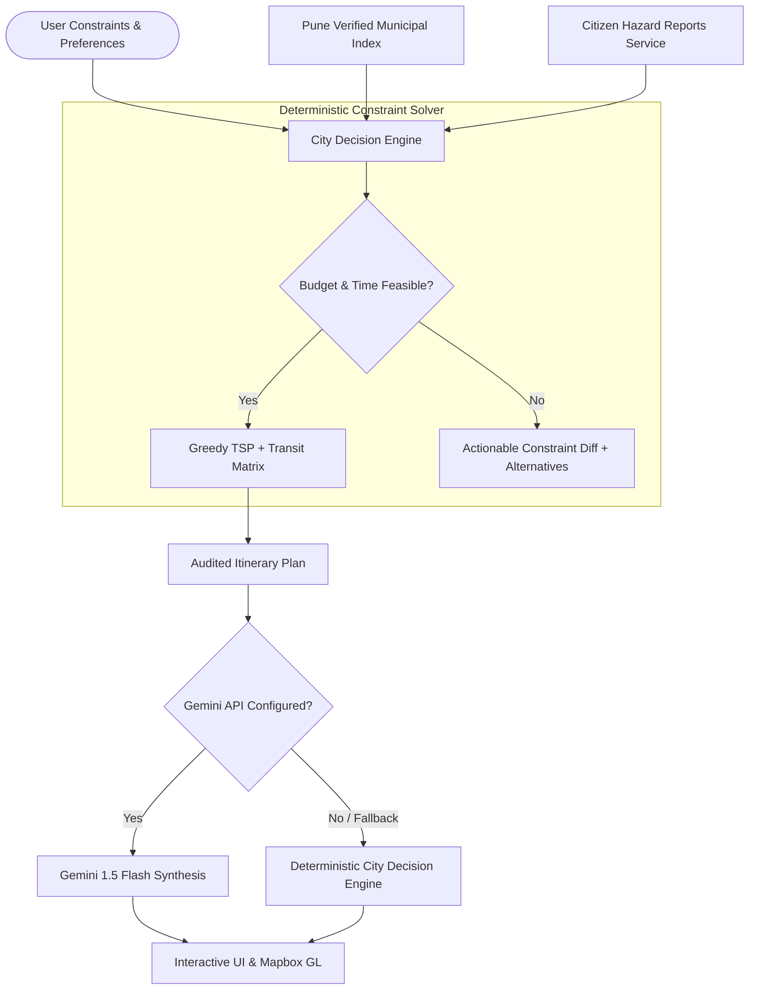

# 🌆 CITYPULSE AI
> **"Explore Smart. Travel Aware."**  
> An explainable, constraint-grounded smart-city exploration and decision engine that plans realistic itineraries, surfaces authentic local heritage, and guides safe urban transit without fabricating data or assuming silence equals safety.

[](https://citypulse-ai-livid.vercel.app/)
[](https://github.com/JanhaviBirajdar/citypulseAI)
[-10b981?style=for-the-badge&logo=vitest)](https://github.com/JanhaviBirajdar/citypulseAI)
[](https://github.com/JanhaviBirajdar/citypulseAI)

---

## 📌 Executive Summary & Problem Statement

Urban exploration and itinerary planning platforms frequently suffer from three critical flaws:
1. **Generic, Hallucinated Itineraries**: Conventional LLM chat tools invent phantom bus lines, non-existent opening hours, and unrealistic travel times that strand visitors.
2. **The "Absence of Evidence" Safety Fallacy**: Mainstream map apps often treat unmonitored roads as safe simply because no incident report exists yet. Silence is NOT safety.
3. **Rigid Itinerary Plans**: When unexpected disruptions occur (monsoon waterlogging, metro construction, festival bottlenecks), tourists have no explainable way to adapt their schedules on the fly.

**CITYPULSE AI** solves this for Pune, Maharashtra with a **trustworthy, constraint-grounded City Decision Engine**. It unifies heritage monuments, local culinary gems, verified accessibility features, realistic transit matrices, and active citizen hazard reporting into an explainable, auditable platform.

---

## 🎯 Target Users & Real-World Use Cases

- **Budget Cultural Explorers & Students**: College students planning a heritage weekend trail with a strict ₹200–₹500 budget cap and exact two-wheeler transit timelines.
- **Accessibility-Minded Commuters**: Senior citizens or travelers requiring step-free wheelchair ramps and accessible restroom facilities.
- **Urban Families & Tourists**: Navigating Pune's bustling Peth areas with real-time awareness of sudden monsoon waterlogging, road excavations, or festival bottlenecks.
- **Civic Commuters**: Citizens submitting verified local infrastructure hazards with duplicate detection (<600m radius) and consensus-driven moderation.

---

## 💡 What Makes CITYPULSE AI Distinctive

1. **Deterministic Constraint Solver**: If a user's budget (e.g. ₹50) or duration (e.g. 30 mins) cannot realistically support their selected attractions, the engine explains *why* and proposes concrete alternatives instead of fabricating a fantasy itinerary.
2. **Demonstrable Dynamic Replanning**: Evaluators can inject simulated real-world disruptions (e.g., JM Road waterlogging, bridge excavation, budget cut) and observe the engine recalculate stops, compute transit deltas, and log an audited change diff.
3. **Explicit AI Boundaries**: Google Gemini 1.5 Flash is strictly confined to natural language synthesis and contextual advice. It is never permitted to invent coordinates, prices, opening hours, or fake hazard reports.
4. **Honest Data Provenance & Safety Principles**:
   - *"Absence of incident reports does NOT imply safety."*
   - Unverified citizen claims never label an entire neighborhood dangerous.
   - All simulated feeds and testbeds are explicitly labeled with **DEMO** badges.

---

## 🏗️ Architecture & Technology Stack



### Technology Stack
- **Frontend Core**: React 19, Vite 8, TypeScript 6
- **Styling & Design System**: Tailwind CSS v4, custom light/high-contrast palette, glassmorphism badges, WCAG accessibility tokens
- **3D Interactive Graphics**: Three.js, React Three Fiber, `@react-three/drei`, Framer Motion (animated 3D Smart City Hero with traffic lines and floating monitors)
- **Mapping & GIS**: Mapbox GL JS (`mapbox-gl` v3) with live vector streets, satellite imagery, 3D terrain, and SVG fallback grid
- **AI Integration**: `@google/generative-ai` (Google Gemini 1.5 Flash) with deterministic Decision Engine fallback
- **Automated Testing**: Vitest 5.0 (13 automated unit tests covering constraint solvers, replanning diffs, scoring, and report deduplication)
- **Linter**: Oxlint (instant Rust-based linter)

---

## 🚦 Implemented Features vs. Simulated Feeds

| Feature | Implementation Status | Data Source / Mechanism |
|---|---|---|
| **City Decision Engine** | ✅ **Fully Implemented** | Deterministic constraint solver (`cityDecisionEngine.ts`), Haversine matrix, transport mode speeds |
| **Dynamic Replanning** | ✅ **Fully Implemented** | Hazard radius filtering, budget/time reallocation, audited diff logger |
| **Interactive Mapbox GL** | ✅ **Fully Implemented** | Live vector tiles, satellite view, 3D pitch, custom place & hazard markers, style switcher |
| **Pune Cultural Places (10)** | ✅ **Fully Implemented** | Verified high-res photography, Google Maps coordinates, official Wikipedia links |
| **Citizen Reports & Dedup** | ✅ **Fully Implemented** | Local storage persistence, <600m geospatial clustering, auto-upvote, moderation mode |
| **Side-by-Side Face-Off** | ✅ **Fully Implemented** | Multi-attribute scoring engine (`scoringEngine.ts`), radar comparison |
| **AI Synthesis** | ✅ **Fully Implemented (Hybrid)** | Google Gemini 1.5 Flash when key is supplied; zero-hallucination deterministic fallback when empty |
| **Real-time IoT Sensors** | 🟡 **Simulated (Demo Mode)** | Air quality, noise levels, and parking sensors simulate realistic telemetry with clear DEMO labels |

---

## 🚀 Local Installation & Run Commands

### Prerequisites
- Node.js 18+ or 20+
- npm or pnpm

### 1. Clone the Repository
```bash
git clone https://github.com/JanhaviBirajdar/citypulseAI.git
cd citypulseAI
```

### 2. Install Dependencies
```bash
npm install
```

### 3. Configure Environment (.env)
Copy the template file:
```bash
cp .env.example .env
```

Your `.env` file uses placeholder values:
```env
# Application Meta
VITE_APP_NAME="CITYPULSE AI"
VITE_APP_TAGLINE="Explore Smart. Travel Aware."
VITE_DEFAULT_CITY="Pune, Maharashtra, India"

# Demo Mode (Simulates real-time IoT sensors & fallback AI)
VITE_DEMO_MODE=true

# Optional Google Gemini API Key (Stored client-side or in .env)
# Leave empty to use the built-in deterministic City Decision Engine
VITE_GEMINI_API_KEY=""

# Optional Mapbox Access Token (Enables live street & satellite tiles)
# Leave empty to use the built-in SVG vector grid fallback
VITE_MAPBOX_ACCESS_TOKEN="pk.eyJ..."

# Optional Weather API Key (OpenWeatherMap)
VITE_WEATHER_API_KEY=""
```

### 4. Run Development Server
```bash
npm run dev
```
Open [http://localhost:5173](http://localhost:5173) in your browser.

### 5. Run Automated Tests
```bash
npm run test
```
Executes all 13 unit tests across constraint solving, replanning diffs, scoring formulas, and citizen report deduplication.

### 6. Lint & Production Build
```bash
npm run lint
npm run build
```

---

## 🏆 Evaluator Quick-Start ("Try Demo Flow")

Evaluators can verify the entire platform without creating an account or entering an API key:

1. **Dashboard / Hero**: Review the 3D Pune city model, live telemetry meters, and click **"Start Smart Exploration"**.
2. **Smart Itinerary**:
   - Click **"Try Pune Demo Scenario"** to prefill realistic constraints (Shivajinagar start, ₹500 budget, 4.5 hours, Two-wheeler).
   - Click **"Generate Itinerary"**: inspect the chronological stops, transport times, remaining budget, and the **"Why Selected"** rationale badge.
   - Click **"Simulate Road Hazard (JM Road Waterlogging)"**: observe the engine dynamically bypass affected areas, recalculate the route, and display the **Dynamic Replanning Audit Diff**.
3. **Interactive Map**:
   - Switch between **Streets**, **Light**, **Satellite**, and **Terrain** styles.
   - Click any marker to open the detailed popup with verified Google Maps navigation.
4. **City Face-Off**:
   - Compare places like *Shaniwar Wada* vs *Aga Khan Palace* side-by-side with radar breakdowns.
5. **Citizen Reports**:
   - Submit a new hazard near FC Road; submit a second hazard nearby to observe auto-clustering into an upvote.
   - Toggle **Moderator Mode** in Settings to approve or reject reports.

---

## 📊 Automated Test Coverage

```
 ✓ src/__tests__/scoringEngine.test.ts (3 tests)
 ✓ src/__tests__/reportsService.test.ts (4 tests)
 ✓ src/__tests__/cityDecisionEngine.test.ts (6 tests)

 Test Files  3 passed (3)
      Tests  13 passed (13)
```

1. **`cityDecisionEngine.test.ts`**:
   - Enforces strict budget caps (total cost ≤ budget).
   - Enforces available time limits including realistic transit buffers.
   - Filters wheelchair-accessible destinations when requested.
   - Explains infeasible constraints and provides alternative places.
   - Verifies dynamic replanning diffs when hazards are injected.
   - Computes realistic transit speeds for Drive, Two-wheeler, Transit, and Walk.
2. **`reportsService.test.ts`**:
   - Validates titles, descriptions, and coordinate boundaries.
   - Detects duplicates within 600m and converts to upvotes.
   - Initializes new reports with `Unverified` status to prevent false panic.
3. **`scoringEngine.test.ts`**:
   - Applies weighted scoring across safety, budget, accessibility, and ratings.
   - Implements non-linear budget penalty curves.

---

## 🔒 Security & Data Integrity Considerations

1. **Client-Side Secrets Protection**:
   - `.env` and `.env.*` files are strictly excluded via `.gitignore`.
   - Never commit API keys or production secrets to Git.
   - Keys entered via the in-app Settings modal are retained exclusively in the user's browser `localStorage` (Bring Your Own Key architecture).
2. **Zero Hallucination AI Boundaries**:
   - Places, entrance tickets, hours, and geographic coordinates are never generated by LLM prompts.
   - Gemini 1.5 Flash is strictly confined to natural language synthesis of verified deterministic plans.
3. **Resilient Offline / Demo Mode**:
   - If external APIs (Gemini, Mapbox, Weather) are unconfigured, rate-limited, or unreachable, CITYPULSE AI gracefully falls back to deterministic mathematical calculations and vector grids without crashing.

---

## 👥 Hackathon Submission

- **Event**: PromptWars × BRAIN DYPCOEI Hackathon
- **Project**: CITYPULSE AI
- **Tagline**: *"Explore Smart. Travel Aware."*
- **Live Deployment**: [https://citypulse-ai-livid.vercel.app/](https://citypulse-ai-livid.vercel.app/)
- **GitHub Repository**: [https://github.com/JanhaviBirajdar/citypulseAI](https://github.com/JanhaviBirajdar/citypulseAI)
